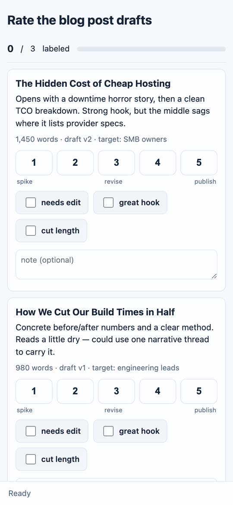

# siftrate

**Rate a pile of things from your phone. One Python file, zero dependencies.**

Point siftrate at a JSON config describing your items and a scoring scheme. It serves a
mobile-first tap-to-score UI on your own network and writes every rating to a JSON file
you own. No database, no Docker, no account, no build step — just the Python standard
library.



```bash
python3 siftrate.py --config examples/blog-post-drafts.json
# open the printed URL — tap, score, done
```

Or straight from PyPI:

```bash
pipx run siftrate --config myreview.json
```

## Why this exists

I built a throwaway script one evening to rate a batch of Substack posts from my phone —
and kept reaching for it. Rating job applicants' take-homes. Triaging a photo dump.
Scoring blog drafts. Every "look at N things and record a judgment on each" task turned
out to be the same tool. So I cleaned it up.

The insight worth keeping: most rating jobs don't need an annotation *platform*. They need
a list, a scale, your thumb, and a results file.

## What it does

- **Config in, JSON out.** Describe items + a labeling scheme in one JSON file; get one
  merged results file back. Both are yours, both are plain JSON.
- **Phone-first UI.** Big tap targets, one item per screen, progress bar, swipe-free
  navigation. Built to be used with a thumb on a couch, not a mouse in a lab.
- **Scale + flags + notes.** A numeric scale (with optional captions like "poor"/"great"),
  multi-select flag toggles, and a free-text note — any combination, per config.
- **Resumable + crash-safe.** Results are merged and rewritten atomically on every tap.
  Kill it mid-review, restart, and you're exactly where you left off.
- **Private by default.** Binds `127.0.0.1` unless you say otherwise. No telemetry, no
  outbound calls, ever — verify it yourself, it's one file.

## Quickstart

1. Copy `siftrate.py` anywhere (or `pip install -e .` / `pipx run siftrate` once published).
2. Write a config (30 seconds):

```json
{
  "title": "Rate the blog post drafts",
  "items": [
    {"id": "draft-01", "title": "The Hidden Cost of Cheap Hosting",
     "meta": "1,450 words · draft v2", "body": "Opens with a downtime horror story…"}
  ],
  "labels": {
    "scale": {"min": 1, "max": 5, "captions": {"1": "kill it", "5": "publish as-is"}},
    "flags": ["needs edit", "off-brand"],
    "note": true
  },
  "output": "results.json"
}
```

3. Run it, open the URL, tap through the pile.
4. Read `results.json`:

```json
{
  "draft-01": {"score": 4, "flags": ["needs edit"], "note": "tighten the middle",
               "updated_at": "2026-07-02T01:00:00Z"}
}
```

Three ready-to-run examples live in [`examples/`](examples/): blog-draft review,
photo-dump triage, and take-home grading.

## Config reference

| Key | Required | What it does |
|---|---|---|
| `title` | no | Page heading |
| `items` / `items_file` | yes (one of) | Inline array, or a path to a JSON array |
| `items[].id` | yes | Stable key in the results file |
| `items[].title` / `body` / `url` / `meta` | no | What renders on the card (`body` takes text or HTML; `url` links the title) |
| `labels.scale` | no | `{min, max, captions?}` numeric scale |
| `labels.flags` | no | Array of toggle labels |
| `labels.note` | no | `true` for a free-text field per item |
| `output` | yes | Results JSON path (merged, atomic writes) |
| `host` / `port` | no | Default `127.0.0.1:8091` |

CLI flags override config: `--config` (required), `--host`, `--port`, `--token`.

## Rating from your phone (the security model)

siftrate binds localhost by default, which is safe and useless for thumbs. To rate from
your phone, widen the bind to a network you trust — and gate it:

- **Best: a tailnet.** Run it on any machine on your [Tailscale](https://tailscale.com)
  network, `--host <tailscale-ip>`, open the URL on your phone. Encrypted, invite-only,
  zero exposure.
- **Trusted LAN:** `--host 0.0.0.0 --token some-secret` — the token gates every route
  (link becomes `http://…/?token=some-secret`, which the UI persists).
- **Never** expose it to the open internet. It's a review tool, not a web service.

Rule of thumb the tool enforces in its help text: widen the bind → bring `--token`.

## Why not Label Studio / Argilla / Prodigy?

Those are annotation *platforms* — servers, databases, users, project models, ML tooling.
Genuinely great when you're labeling training data at scale with a team.

| | siftrate | Label Studio | Argilla | Prodigy |
|---|---|---|---|---|
| Install | copy 1 file | Docker + Postgres | server + client | paid license |
| Time to first rating | ~30 seconds | an afternoon | an hour | an hour |
| Phone-first UI | yes | no | no | no |
| Output | one JSON file | export pipeline | dataset API | dataset |
| Dependencies | zero | many | many | many |
| Team workflows / ML loops | no | yes | yes | yes |

If you need inter-annotator agreement, active learning, or ten reviewers — use a platform.
If you need *your own judgment recorded over a pile of items before dinner* — that's this.

## Development

```bash
python3 siftrate.py --config examples/photo-triage.json   # run from source
pip install -e . && siftrate --help                        # entry point
```

Zero runtime dependencies is a feature, not an accident — contributions that add one need
a very good story.

## License

MIT © Toby Rosen
